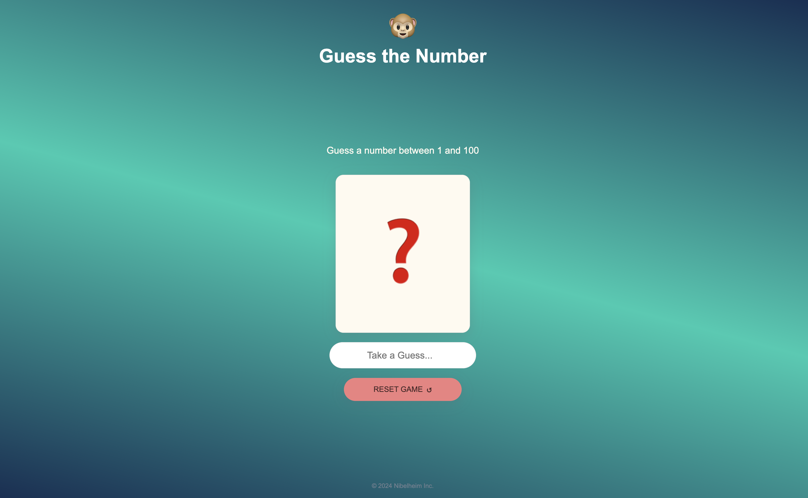

# Simple 'Guess the Number' Game

The computer randomly selects a number between 1 and 100.

The user starts guessing using the input form.

If the number entered is the right one the game is over and the user wins.

If the number entered is lower, or higher, the guessed number enters a list of already 'used' numbers and the user can try again.

If a number is repeated, the computer will tell the user.d

To start over, theres a button to reset.

Learning notes:

- This tiny project has been useful to learn some simple things on how to manipulate the DOM.

- Could be expanded with more features like, adding a list with the numbers already guessed and telling the user that he/she's repeating that number.

